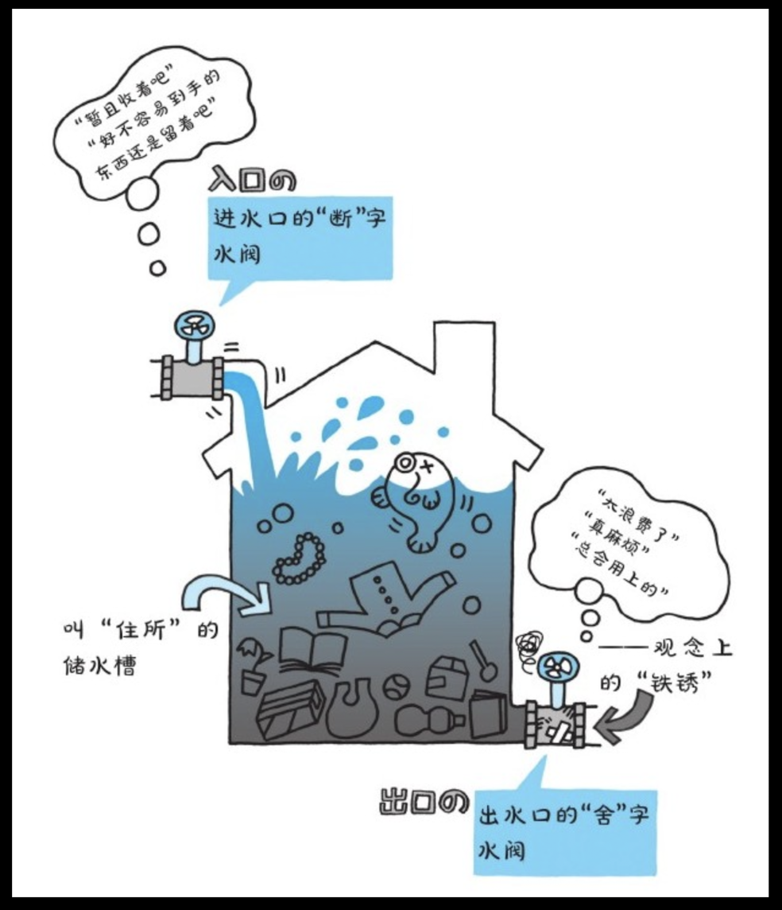

# 断舍离 - 山下英子

**放手一个无用之物，就腾出一点空间。处理一件多余之物，就减少一份负担。减少一次浪费，就恢复一分精气神。然后，翻开人生新篇章。**

## 断舍离的奥义不只是扔东西

斩“断”物欲

“舍”弃废物

脱“离”执念

断舍离并不是单纯地处理杂物、抛掉废物，而是在充满闭塞感的人生长河里唤醒“流通”的生命气息。

本书最大的目的是撼动我们根深蒂固的“物品价值观”，鼓励我们甩掉惰性，采取行动，促进生活和生命的新陈代谢，从而迎来焕然一新的人生。

> 正如其所言，断舍离这本书带给我最大变化是对价值观的变化，以前总是觉得东西留着总会有用的，不断的留、藏；对过去充满了怀念与执着，一些无用之物或许因可以唤起回忆而被留下。
> 
> 只进不出总会有被填满的一天。如果再不采取行动，用不了多久生活或内心都将被无用之物所占满。
> > 在读完这本书后，在一个周日，我将几个用于放杂物的柜子进行整理，大多数东西都是无用之物或是勉强可用但替代品已是随处可见。
> > 
> > 更为讽刺的是，曾经不舍得用，被藏起来的物件，再次被翻出时已无法再使用了，有的甚至已布满了霉点与锈迹。

## 第一章 你之所以无法放下的原因

